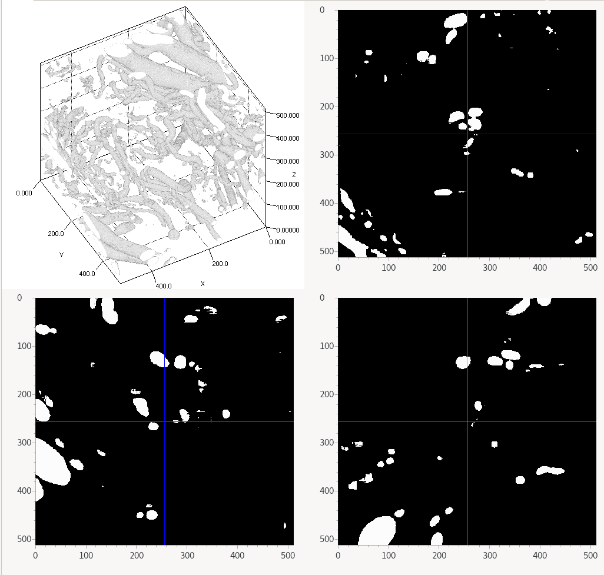

# Mini-tutorial. Using `Volume Segmantics` to train a model to segment blood vessels from synchrotron X-ray micro-CT data of human placental tissue. 

The data for this tutorial comes from experiments described in [this paper](https://royalsocietypublishing.org/doi/10.1098/rsif.2021.0140). The [full dataset](https://www.ebi.ac.uk/empiar/EMPIAR-10562/) is publicly available on EPIAR.

In this tutorial we will be using a $256^3$ pixel training dataset and corresponding segmentation labels to train a segmentation model. Then we will then download a larger $512^3$ pixel dataset and predict a segmentation for all the the blood vessels contained within this new region of data.

## Library set-up and then training a model

Installation and configuration is also described in the [README](https://github.com/DiamondLightSource/volume-segmantics) for the `Volume Segmantics` repository:

1. `pip install volume-segmantics` into a conda environment or pip vitualenv and activate it.
2. Create a new directory for working through the tutorial.
3. Download and unzip the [`volseg-settings`](https://github.com/DiamondLightSource/volume-segmantics/releases/download/v0.2.6/volseg-settings.zip) directory and the [`training-data`](https://github.com/DiamondLightSource/volume-segmantics/releases/download/v0.2.6/training-data.zip) directory into your new folder.
4. If required, edit settings in the file `volseg-settings/2d_model_train_settings.yaml`. For example you may want to change the model architecture or number of training epochs.
5. Train the model using the command `model-train-2d --data training-data/vessels_256cube_DATA.h5 --labels training-data/vessels_256cube_LABELS.h5`. A model will be saved to your working directory. In addition, a figure showing "ground truth" segmentation vs model segmentation for some images in the validation set will be saved. Look at this to get an idea of how your model is performing.

## Using your model to predict a segmentation on another region of data.

We will use our model trained in the step above to predict segmentation for a larger region of data. Since this $512^3$ region of data (159MB) is too large to store in the GitHub repository, we'll download it from Zenodo. 

1. You can download using your web browser via [this link](https://zenodo.org/api/files/fc8e12d1-4256-4ed9-8a23-66c0d6c64379/specimen1_512cube_zyx_800-1312_1000-1512_700-1212_DATA.h5), alternatively you can use a command-line tool such as `curl` like so: `curl -o specimen1_512cube_zyx_800-1312_1000-1512_700-1212_DATA.h5 https://zenodo.org/api/files/fc8e12d1-4256-4ed9-8a23-66c0d6c64379/specimen1_512cube_zyx_800-1312_1000-1512_700-1212_DATA.h5`
2. If required, edit settings in the file `volseg-settings/2d_model_predict_settings.yaml`. For example, you may wish to change the strategy used for prediction by changing the `quality` setting, the defaults should give a decent result.
3. Predict the segmentation using the command `model-predict-2d <name of model file>.pytorch specimen1_512cube_zyx_800-1312_1000-1512_700-1212_DATA.h5`. An HDF5 file containing a segmentation prediction will be saved in your working directory. 
4. To view the HDF5 output, you can use a program such as [DAWN](https://dawnsci.org/downloads/). 

For example, here is an example of a volume representation of the output along with slices in the three orthogonal planes viewed with DAWN. This prediction was done using a U-Net with pre-trained ResNet-34 encoder using the "Medium" (3-axis) quality setting. 

